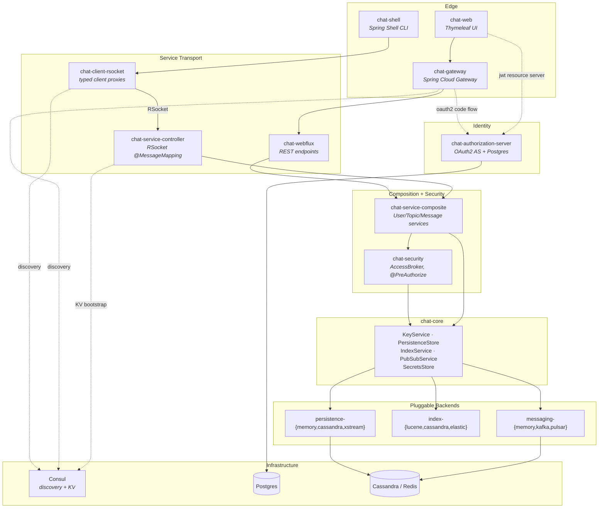
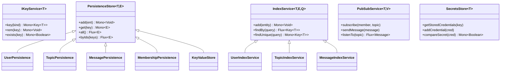
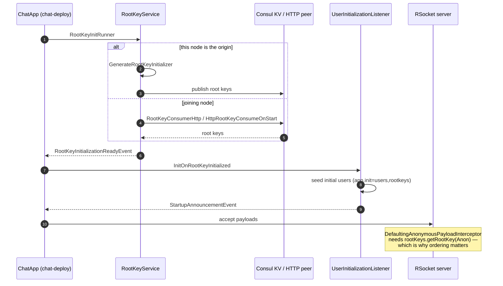
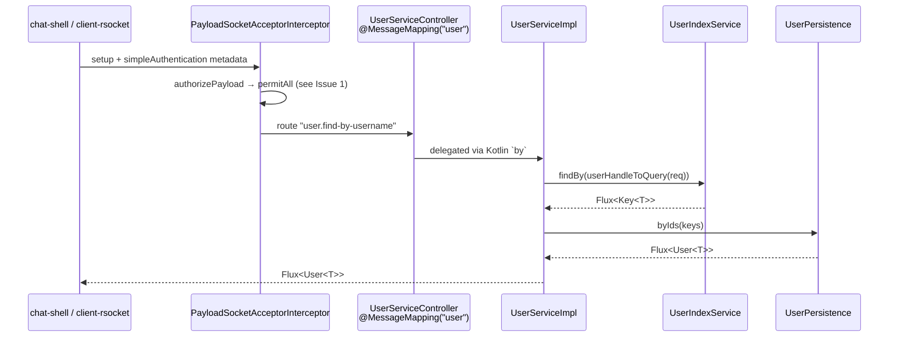
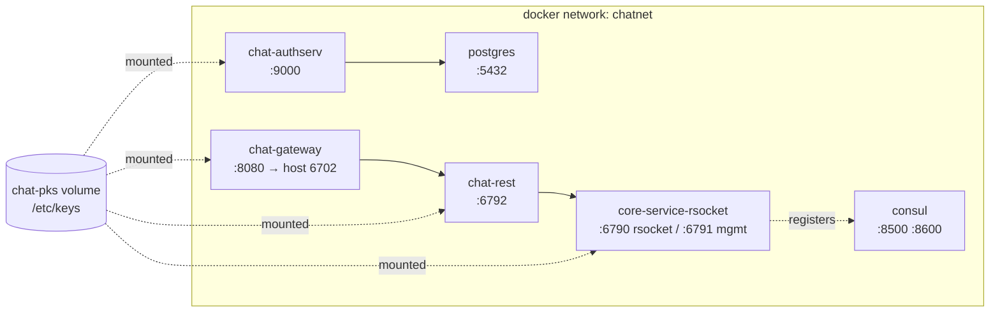

# demo-chat — Architecture Map

**Code name: ImpactDriver.** An RSocket-first substrate for chat-room-shaped message flows: identity, authorization, pluggable persistence/index/messaging backends, and the infrastructure to run it.

This document ties the ~30 Maven modules into one picture, then names two defects worth fixing on the next coding run.

---

## 1. The Layer Cake

Every module falls into exactly one of six roles. Once you know the role, you know what the module is allowed to depend on.

| Role | Modules | Responsibility |
|---|---|---|
| **Domain + contracts** | `chat-core` | Domain types, the five core service interfaces, bean-definition supertypes, codecs |
| **Composition** | `chat-service-composite` | Assembles core services into `User` / `Topic` / `Message` use cases |
| **Security** | `chat-security`, `chat-authorization-server` | Authentication, access brokering, `@PreAuthorize` contracts, OAuth2 AS |
| **Transport (server)** | `chat-service-controller`, `chat-webflux`, `chat-web`, `chat-gateway` | RSocket `@MessageMapping` controllers, REST, Thymeleaf UI, edge routing |
| **Transport (client)** | `chat-client-rsocket`, `chat-client-consul`, `chat-shell` | Typed RSocket client proxies, service discovery, interactive CLI |
| **Backend adapters** | `chat-persistence-*`, `chat-index-*`, `chat-messaging-*` | Cassandra / Redis-Streams / memory / Lucene / Elastic / Kafka / Pulsar |
| **Deployment** | `chat-deploy*`, `shared-*`, `devops/`, `shell-scripts/` | Runnable apps, profile wiring, Docker, K8s, Consul |



---

## 2. The Five Core Contracts

`chat-core` is deliberately thin. Everything downstream is an implementation of one of five interfaces, all reactive (`Mono`/`Flux`), all generic over a key type `T` (Long via Snowflake, or UUID — selected by `app.key.type`).



The **conflation layer** (`chat-core/service/conflate/`) is the glue that makes these composable without any backend knowing about the others:

- `IndexedPersistence` — write-through: persist, then index.
- `KeyEnricherPersistenceStore` — mints a key from `IKeyService` before persisting.
- `PubSubbedPersistence` — persist, then fan out to the topic.
- `LoadablePersistedIndex` — rehydrates an in-memory index (Lucene) from the persistence store at boot.

That decomposition is what lets `chat-deploy-memory` and `chat-deploy-cassandra` be the same app with different beans.

### KV caching

Two distinct key/value paths, easy to confuse:

1. **`KeyValueStore<T,V>`** — a first-class core contract with a typed accessor surface (`typedGet`, `typedAll`, `typedByIds`), exposed over RSocket by `KeyValueStoreController` and consumed via `KeyValueStoreClient`. This is application-level caching.
2. **`ConsulKVStore`** (`chat-client-consul`) — implements `InitializingKVStore : KeyValueStore<String,String>` against Consul's KV API. This is *bootstrap* state — specifically the root keys that must be shared across service instances before any of them can serve traffic.

---

## 3. Startup and Root-Key Bootstrap

The single most non-obvious runtime behavior. Services cannot serve requests until well-known "root keys" (`Admin`, `Anon`, and domain roots) exist and agree across the cluster. `chat-deploy` drives this with an application-event chain.



Root keys are also exposed as a custom actuator endpoint (`RootKeyEndpoint`, management id `rootkeys`), which is how a second node discovers them over HTTP when Consul is not in play. `ActuatorWebSecurityConfiguration` guards that surface.

---

## 4. Request Path — RSocket Composite Call



Controllers are pure delegation — `class UserServiceController<T>(b: CompositeServiceBeans<T,V>) : ChatUserService<T> by b.userService()`. The mapping annotations live in separate `*ControllerMapping` interfaces so the same service contract can be re-bound to a different transport without touching logic.

---

## 5. Deployment Topology



Port allocation is centralized in `shell-scripts/ports.sh` and derived arithmetically from `CORE_PORT` (default 6790): rsocket = base, mgmt = base+1, http = base+2, http-mgmt = base+3.

Launch is script-driven, one script per role — `run-core.sh`, `run-rest.sh`, `run-gateway.sh`, `run-authserv.sh`, `run-shell.sh` — each taking an *execution strategy* (`build` | `runlocal` | `rundocker`) and a *deployment profile* (`memory` | `cassandra` | `cassandra_astra`). All of them funnel into `build-app.sh`, which turns the profile into a Maven profile plus a wall of `-Dapp.*` toggle properties. Those toggles are the actual composition mechanism: nearly every `@Configuration` in the tree is gated by `@ConditionalOnProperty`.

```
run-core.sh memory
  └─ build-app.sh -m chat-deploy -s memory -e rsocket -k long -i users,rootkeys
       └─ -Dapp.service.core.{key,pubsub,index,persistence,secrets}
          -Dapp.service.composite -Dapp.service.composite.auth
          -Dapp.controller.{persistence,index,key,pubsub,secrets,user,topic,message}
```

TLS material is shared through the external `chat-pks` Docker volume, populated by `gen-dckeys.sh` / `docker-create-pks-vol.sh`. The client side picks a transport factory to match: `InsecureConnection`, `UnprotectedConnection`, `JKSSecureConnection`, or `PKCS12ClientConnection`.

---

## 6. Issues to Fix Next Run

### Issue 1 — Composite RSocket API is unauthenticated end to end (security)

Two independent gaps line up so that neither backstops the other.

**Gap A — transport layer permits everything.**
`chat-service-controller/.../config/rsocket/RSocketServerConfiguration.kt:23`

```kotlin
// TODO: lock down!
.authorizePayload { authorize ->
    authorize.setup().permitAll()
        .anyExchange().permitAll()
        .anyRequest().permitAll()
}
```

`simpleAuthentication` is installed, so credentials are *parsed* — but no route requires them.

**Gap B — the `@PreAuthorize` contracts are never bound to the beans.**
`chat-security` defines annotated interfaces (`security/access/composite/UserServiceAccess.kt` and siblings) that extend the plain service contracts:

```kotlin
interface UserServiceAccess<T> : ChatUserService<T> {
    @PreAuthorize("@chatAccess.hasAccessToDomain('User', 'NEW')")
    override fun addUser(userReq: UserCreateRequest): Mono<out Key<T>>
    ...
}
```

`CompositeControllersConfiguration.kt:10-12` **imports** `UserServiceAccess`, `TopicServiceAccess`, `MessageServiceAccess` — and then declares controllers against the *unannotated* parents:

```kotlin
class UserServiceController<T, V>(b: CompositeServiceBeans<T, V>) :
    UserServiceControllerMapping<T>, ChatUserService<T> by b.userService()
    //                               ^^^^^^^^^^^^^^^^ should be UserServiceAccess<T>
```

Three unused imports are the fingerprint of an abandoned refactor. The decorator alternative was abandoned too: `CompositeServiceAccessBeansConfiguration` is fully written but has no `@Configuration` — both call sites are commented out, and `CompositeAccessBeansConfiguration` is an empty class body wrapping a comment block.

Net effect: with `app.service.composite.auth` set, `MethodSecurityConfiguration` registers `@chatAccess` and `@EnableReactiveMethodSecurity` — but there are no annotations on any bean in the proxy chain for it to enforce. Every `user.*`, `topic.*`, `message.*` route is callable by an anonymous connection.

**Fix:** pick one enforcement strategy and complete it.
- *Preferred (annotations):* change the three controllers to implement `UserServiceAccess<T>` / `TopicServiceAccess<T,V>` / `MessageServiceAccess<T,V>`, and confirm the CGLIB/interface proxying actually applies — `@PreAuthorize` on an interface method requires the proxy to expose that interface.
- *Alternative (decorators):* restore `CompositeAccessBeansConfiguration` as a real `@Configuration` gated on `app.service.composite.auth`, delegating through `CompositeServiceAccessBeansConfiguration`.
- Either way, tighten `authorizePayload` to `.route("user.**").authenticated()` etc., leaving only `setup()` and the login route open.
- `chat-security/src/test/.../MethodSecurityIntegrationTests.kt` already exercises the annotated interfaces directly — which is exactly why the gap survived: the tests pass against the interface, not against the wired controller. Add a controller-level integration test.

### Issue 2 — OAuth2 authorization-code flow cannot complete (config)

Four config sources disagree about who the client is and where it lives.

| Source | Value |
|---|---|
| `chat-gateway/application.yml` | `redirect-uri: http://authserv:9000/login/oauth2/code/{registrationId}`, registration id `spring`, issuer `http://authserv:9000` |
| `chat-authorization-server/application.yml` | registered redirect: `http://authserv:9001/login/oauth2/code/chatClient` |
| `chat-web/application.yml` | `issuer-uri: ${app.oauth2.issuerUri:http://authserv:8080}` |
| `devops/docker/docker-compose.yaml` | service name `chat-authserv`, published `9000:9000`; gateway published `6702:8080` |

Four separate breaks:

1. **Redirect target is the wrong host entirely.** A redirect URI must point at the *client* (the gateway, `:6702`), not at the authorization server. As written, the browser is sent back to the AS after consent and the gateway never receives the code.
2. **Registration id mismatch.** `{registrationId}` expands to `spring`, so the gateway sends `.../code/spring`; the AS only whitelists `.../code/chatClient`. Exact-match validation rejects it.
3. **Port mismatch.** Gateway says `:9000` (the AS HTTP port), the AS registers `:9001` (its *management* port per `ports.sh`).
4. **Hostname does not resolve.** No service or network alias named `authserv` exists on `chatnet` — the compose service is `chat-authserv`. Same class of bug sits one file over: `chat-authserv`'s `SPRING_DATASOURCE_URL` is `jdbc:postgresql://consul:5432/authserver`, pointing the datasource at Consul instead of `postgres`.

**Fix:**
- Gateway: `redirect-uri: "{baseUrl}/login/oauth2/code/{registrationId}"` (Spring's own placeholder — survives the container-vs-host port split), and align the registration key with `chatClient` on both sides.
- AS: register `http://localhost:6702/login/oauth2/code/chatClient` (plus the in-network form if server-to-server redirect is ever needed).
- Compose: add `aliases: [authserv]` under the `chatnet` entry for `chat-authserv`, or rename the service.
- Compose: `SPRING_DATASOURCE_URL: jdbc:postgresql://postgres:5432/authserver`, and add `depends_on: [postgres]`.
- Promote every one of these to a single env-var contract (`AUTHSERV_HOST`, `AUTHSERV_PORT`) sourced from `ports.sh`, so the values cannot drift again.

---

## 7. Smaller Notes

- **Orphan modules.** `chat-streams` (17 Kotlin files), `chat-deploy-stream-rabbit`, and `chat-messaging-pulsar` exist on disk but are absent or commented out of the root `<modules>` list — they are not compiled, so they silently rot against interface changes.
- **`chat-gateway/GlobalRouters.kt` is entirely commented out.** The live routing comes from `application.yml` (`uri: http://core-service-http:6792`) — note that hostname also does not match the compose service name `chat-rest`. Same class as Issue 2.
- **`chat-web/application.yml:1-2`** has `port: 8080` unindented under `server:`, so it binds at root, not `server.port`. Harmless today because 8080 is the default, invisible the moment someone changes it.
- **In-flight work.** `chat-messaging-kafka` has uncommitted changes to `KafkaPubSubBeans`, `KafkaTopicAdmin`, `KafkaTopicPubSubService` plus a new untracked `src/test/`.
