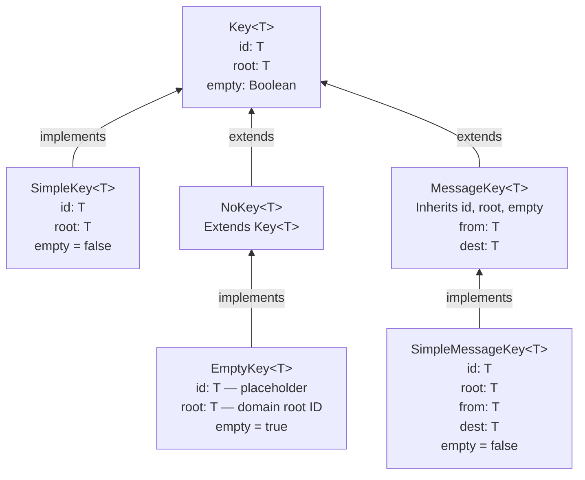
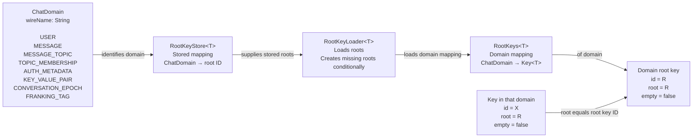
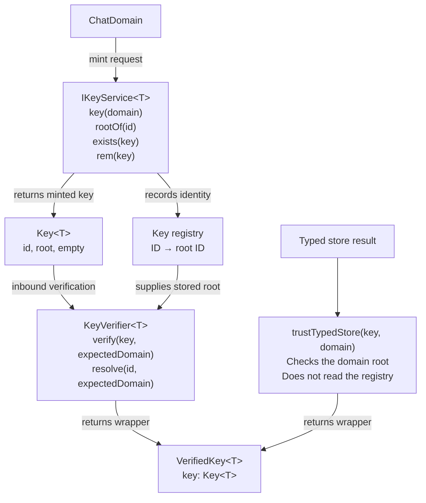
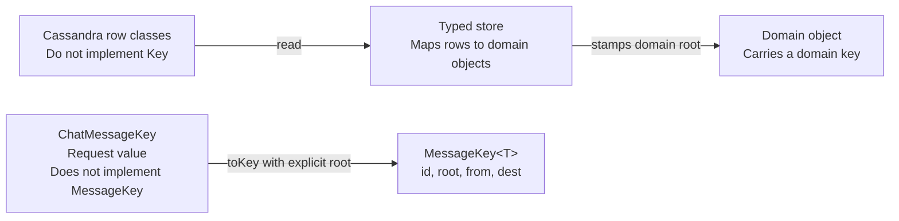

# Key and root identity data graph

These diagrams describe the approved design for `CHAT-avduuqwp`.
They do not report implementation completion.
`T` is the ID type, such as `Long` or UUID.

The sources are the [design specification](superpowers/specs/2026-09-24-key-root-identity-design.md)
and the [approved implementation plan at bb728f54](https://github.com/marios-code-path/demo-chat/blob/bb728f541a4c70d61cde3393f60f41574e27be9e/docs/superpowers/plans/2026-09-25-key-root-identity.md).
The plan defines the implementation steps and verification requirements.

## Key members and implementations

Arrows point from each implementation toward its interface.

Both `id` and `root` are required.
The `empty` property distinguishes a placeholder from an ordinary key.
An empty key still carries the root of its domain.

All implementations compare `id`, `root`, and `empty` for equality.
They use the same fields for their hash code.
The message fields `from` and `dest` remain raw IDs and do not affect equality.
Equality does not verify a root against the registry.

| Factory | Result |
|---|---|
| `Key.of(id, root)` | An ordinary key with the supplied ID and root. |
| `Key.root(id)` | A root key whose `root` equals its `id`. |
| `Key.empty(placeholder, root)` | An empty key with an explicit domain root. |
| `MessageKey.of(id, root, from, dest)` | A message key with raw sender and destination IDs. |

These factories construct values.
They do not register IDs or verify caller claims.

## Domains and roots

`ChatDomain` selects a domain.
A key stores the domain's root ID, rather than the enum value or a class name.

A root key is an ordinary key whose `id` equals its `root`.
Each domain has one root per key type in the configured root store.
Persistent backends retain these roots across restarts.
The memory backend does not retain roots across process restarts.

`Admin` and `Anon` remain user identities.
Their keys carry the `USER` root.
They are not additional domains.

## Minting and verification

The key service also resolves domain root IDs from the root state.
Deleting ordinary registry rows does not remove the roots.
The key service refuses root deletion.

`VerifiedKey<T>` contains a key.
It does not extend `Key<T>`.
Its guarantee depends on the construction path.

| Path | Guarantee |
|---|---|
| `verify(key, expectedDomain)` | Reads the registry. Refuses an unknown ID, a forged root, or a mismatch with a supplied domain. |
| `resolve(id, expectedDomain)` | Reads the registry. Constructs the key with its stored root. Checks a supplied domain. |
| `trustTypedStore(key, domain)` | Checks only that the key root matches the store domain. Trusts the caller and can accept an unknown ID. |

Only `hasAccessToEntity` may call `trustTypedStore`.
The plan requires source guards and independent boundary tests for this restriction.
The `internal` constructor alone does not prove verification.

## Store rows and request values

Store rows and request values do not become additional key implementations.
The three canonical classes retain the common equality rule.
Converting a request value to a key does not verify its identity.
