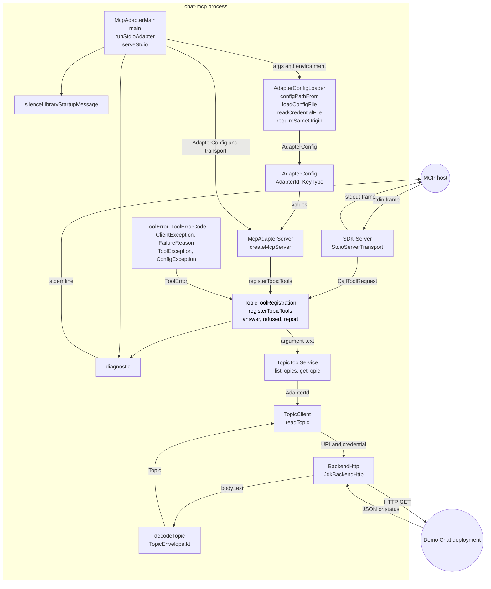
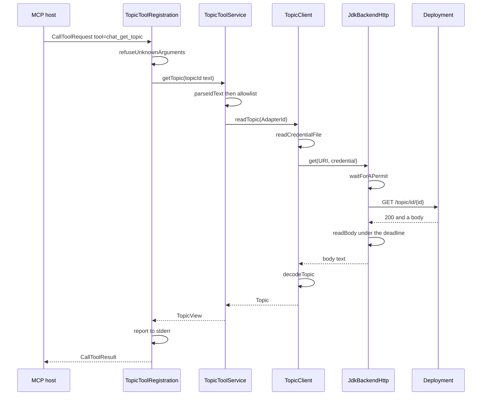
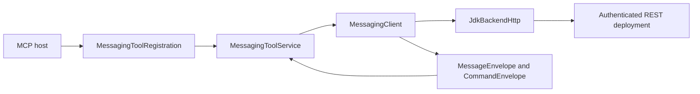

# The MCP adapter client components

This document answers a review of pull request #146. The review asked three
questions.

1. A block diagram of the client components, with data flow and type boundaries.
2. Which patterns already exist in this repository, which ones the adapter did
   not use, and why.
3. Why the adapter added no external library, and why `configPathFrom` works the
   way it does.

The adapter is `chat-mcp`. Its sources separate configuration, HTTP transport, decoding, services, and MCP registration.
`docs/MCP-ADAPTER.md` is the operator document. The design is
`docs/superpowers/specs/2026-09-27-demo-chat-mcp-design.md`.
The messaging contract is `docs/superpowers/specs/2026-10-09-mcp-messaging-design.md`.

## The shape in one paragraph

The adapter is one process with one Spring-free classpath. A host launches it
and speaks MCP to it over stdin and stdout. The adapter reads one properties
file at startup. Each tool call runs the same path: decode the MCP frame, check
the argument, read the credential file, call one REST route, decode the JSON
answer, and shape an MCP result. The failure of a call never carries backend
text to the host.

## The client components

Blocks are types or functions. An arrow is a call. A label names what the call
carries.

`REG` marks the topic registration boundary. Messaging has a separate registration boundary, described below.

## The type boundaries

Each seam changes the type vocabulary. A type that crosses one seam does not
cross the next.

| Seam | Types that cross | Types that do not cross |
|---|---|---|
| Host to `StdioServerTransport` | MCP frames. `CallToolRequest`, `CallToolResult`, `Tool`, `ToolSchema` | No adapter type enters the SDK |
| `TopicToolRegistration` to `TopicToolService` | `String` argument text, `Set<String>` of allowed names, `TopicView`, `List<TopicView>`, `JsonObject` | No MCP type enters the service. The service KDoc states this |
| `TopicToolService` to `TopicClient` | `AdapterId` alone | No `JsonObject`. No MCP type |
| `TopicClient` to `BackendHttp` | `URI`, credential text, body text | The credential is read for one call and discarded |
| `BackendHttp` to the deployment | HTTP GET or submit POST with a bearer header | No configuration file, no key type, no allowlist |
| Deployment answer to `decodeTopic` | JSON text | No `Double` and no `Float` ever holds an id |
| Any failure to the host | `ToolError(code, message, retryable)`, with the messaging additions described below | `ClientException.message` does not cross. Task 7 rule 4 |
| Process arguments to `configPathFrom` | `List<String>`, `Map<String, String>`, `Path` | No credential and no backend URL arrives as an argument |

## The data flow of one call

Two flows run beside the tool call. The startup flow reads the process
arguments, loads the configuration file, reads the credential once and discards
it, and builds the transport. The failure flow catches a `ClientException` and
answers a fixed sentence.

## The two streams

| Stream | Carrier | Content |
|---|---|---|
| `stdout` | SDK `StdioServerTransport` | JSON-RPC 2.0 frames alone |
| `stderr` | `diagnostic` | One line for each call, and the startup lines |

`diagnostic` writes `chat-mcp: ` and then the message. Two libraries write lines
of their own. `kotlin-logging` writes one line to stdout. `slf4j-api` writes
three warning lines to stderr. `silenceLibraryStartupMessage` sets both
suppression properties before any other class loads.

## Patterns in this repository that the adapter did not use

Each row names a pattern that exists in the repository today, and the reason the
adapter does not use it.

| Pattern | Where it lives | Why the adapter does not use it |
|---|---|---|
| A Spring Boot context with `@ConfigurationProperties` binding | `UserInitializationProperties`, `management-defaults.yml`, `VectorSelectorValidationConfiguration` | The adapter holds **no Spring context**. A context writes a banner and library lines that break the stdout contract. It also puts the store providers on the classpath, and the adapter must hold no direct store access. Plan Task 1 step 4 states this |
| A Spring Shell command surface | `chat-shell`, `docs/SHELL-COMMAND-CONTRACT.md` | Spring Shell serves a human at a terminal. It needs a context, a prompt and a `PasswordEncoder` bean. MCP serves a machine over a pipe, and the host supplies the caller |
| The `Key<T>`, `RootKeys<T>` and `ChatDomain` domain types | `chat-core`, PR #142, `docs/KEY-ROOT-IDENTITY.md` | The adapter must not synthesize a root, accept a placeholder, or expose key minting. `Topic` carries `root` as text that the deployment sent. A `Key` type in this process would invite derivation |
| The `KeyVerifier` route rules, `@Resolved` and `@Verified` | `chat-core` | Those rules belong to the deployment. The adapter reads one route with an id from its own configuration. The deployment still resolves that id |
| Jackson 3 data binding with `ChatJackson3Modules` | PR #105, `DomainWireShapeTests` | A customizer needs a Spring context. Data binding also risks a `Double` for an id above 2^53. The adapter reads a JSON tree and converts the id text itself |
| The `chat-client-rsocket` client modules | `chat-client-rsocket` | That module depends on `chat-core`, `chat-security` and `chat-service-controller`. It speaks RSocket. The adapter speaks REST and holds no store dependency |
| The `chat-build` and `shell-scripts/` launch layer | `docs/BUILD.md`, `shell-scripts/` | Those scripts launch a deployment. The MCP host launches the adapter, and it passes the `--config` argument itself |

### One pattern the adapter did adopt

`rejectUnknownKeys` refuses a configuration key that nothing reads. This mirrors
`UserInitConfigBindingTests`, which reads the shipped `userinit.yml` from disk
for the same reason. Spring ignores an unknown key, and a typo would then have no
effect and no error.

## Why the adapter added no external library

The `chat-mcp` pom declares six compile dependencies. Two are the MCP Kotlin SDK.
Four are Kotlin runtime libraries. It adds no CLI framework, no HTTP client
library, no JSON data binder and no logging provider.

| Candidate | Why the adapter does not use it |
|---|---|
| `picocli`, `clikt` or `kotlinx-cli` | The adapter takes one argument. A framework offers a command tree, help text, type conversion and completion. None is needed. A framework also accepts a new flag as a declaration, and the security rule is that no credential, no backend URL, no sender id, no root and no partition arrives as an argument |
| OkHttp, Ktor client, Apache HttpClient5 | The adapter must check every redirect hop against the configured origin **before** the credential leaves the process. `HttpClient.Redirect.NEVER` gives that hop. The JDK client needs no dependency. A library would add a tree that the guard script, both enforcer rules and the CVSS 9 audit must then manage |
| Jackson | See the table above. The adapter needs the JSON text of an id, and not a bound value |
| A logging provider such as Logback | A provider writes its own format, and its startup banner reaches stdout. The adapter writes one fixed diagnostic line with `System.err.println` |
| `kotlinx-serialization-json` | The adapter **does** use it. The MCP Kotlin SDK speaks it. The adapter declares it directly, because the module inherits no Kotlin runtime from `chat-core` |

### Why the JSON library is not a data binder here

`decodeTopic` reads the body as a tree. It then reads the `id` and the `root`
fields as `JsonPrimitive` content. A Long id arrives as a JSON number above
2^53. The adapter takes the **text** of that number and parses it with its own
rule. So no `Double` ever holds an id and no digit is lost. A data binder would
map that number to a `Long` or to a `Double` by its own rule.

## Why `configPathFrom` works the way it does

`configPathFrom` is a top-level function in `AdapterConfigLoader.kt`. It is 28
lines. It has no dependency and no side effect.

### What it accepts

| Form | Example |
|---|---|
| The argument and a separate path | `--config /etc/chat-mcp.properties` |
| The argument and an inline path | `--config=/etc/chat-mcp.properties` |
| The environment variable, when no argument names a file | `CHAT_MCP_CONFIG=/etc/chat-mcp.properties` |

An argument wins over the environment variable. Every other argument fails the
start with `ConfigException`, and `main` answers exit code 2.

### What that shape bought

1. **The refusal is structural and not a check.** The adapter accepts one
   argument. A caller that sends `--token a-secret` fails the start, because
   `--token` is not `--config`. No later code decides whether to trust a
   credential argument, because no credential argument can arrive. The test
   `a credential argument is refused` pins this.
2. **No silent behaviour change.** A doubled `--config`, an unknown argument and
   a `--config` with no path each fail the start. A misplaced argument cannot
   change behaviour without a report.
3. **No process is needed to test it.** The function takes a list and a map and
   returns a `Path`. Eight tests drive the whole surface with no file and no
   process. See `AdapterConfigLoaderTests`.
4. **Precedence is stated in one place.** An argument wins over the environment
   variable. An MCP host may supply either form, and the rule is not spread
   across call sites.
5. **The credential path stays out of the arguments.** The value is a path to a
   file. A process list shows a path and never a secret.

### What that shape costs

1. No help text and no shell completion. The operator reads
   `docs/MCP-ADAPTER.md` instead.
2. No type conversion. The function returns a `Path` and `loadConfigFile`
   performs the one check that matters.
3. The `--config=` form exists as a second branch, because a host may pass one
   token. That branch is three lines.

The cost is small because the surface is one argument. **The primitive shape is
the price of the refusal rule, and the price is 28 lines.**

### Why the environment variable is a fallback and not a peer

MCP hosts differ. Some pass a command with arguments. Some pass a command and an
environment block. The adapter accepts both, and the argument wins, so one host
configuration cannot half-apply.

## Messaging components

`MessagingToolRegistration` converts MCP arguments and application errors.
`MessagingToolService` checks input limits, configured rooms, and each returned message's room.
`MessagingClient` chooses fixed REST routes and reads the credential for each request.
`MessageEnvelope` and `CommandEnvelope` decode production wire envelopes without numeric ID rounding.
The same `JdkBackendHttp` bounds all requests and never repeats a submission.

Message projections cross the service boundary as `JsonObject` values.
The room check occurs before registration emits those values.
The shipped message-by-ID route allows every authenticated agent to read any message.
The adapter therefore supplies the configured room restriction for that tool.

Successful results carry matching text and `structuredContent`, without metadata.
Most failures contain three `_meta` fields: `code`, `message`, and `retryable`.
An unknown submission adds the validated `requestId`.
An incomplete command retains its result in `structuredContent` and keeps three metadata fields.
See `docs/MCP-ADAPTER.md` for the complete shapes and retry conditions.

The earlier diagrams describe the topic path introduced at `3295f7c3`.
They do not imply that messaging reuses the topic service or topic decoder.
Production REST authentication and credential issuance now exist.
The dated acceptance records distinguish locally signed test tokens from authorization-server-issued tokens.
The adapter runtime still contains no Spring context or direct store access.
