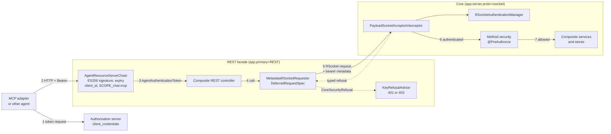
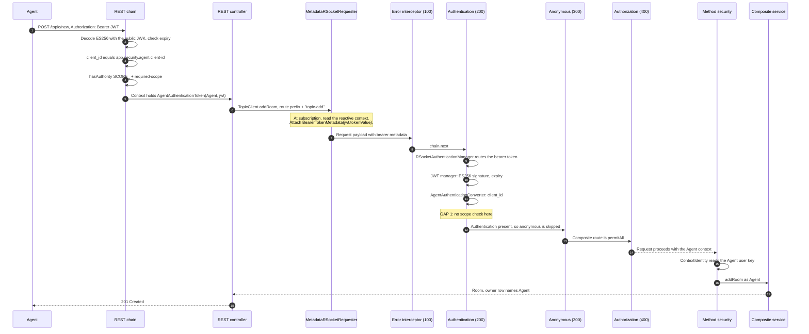
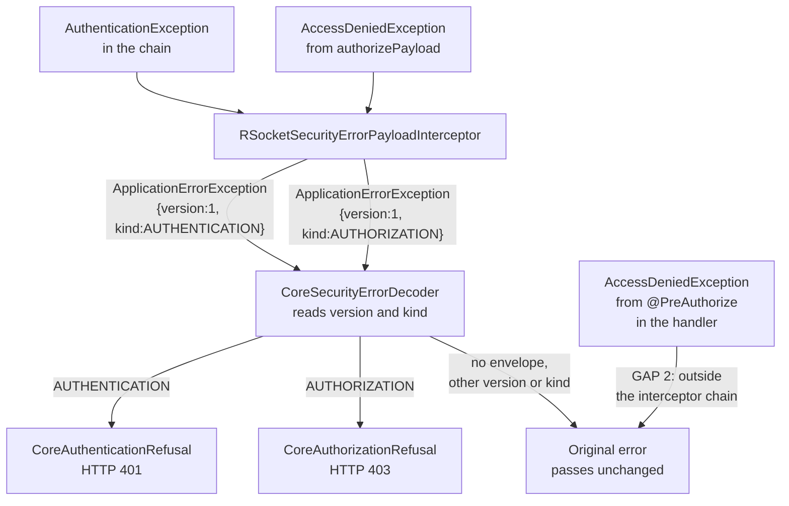
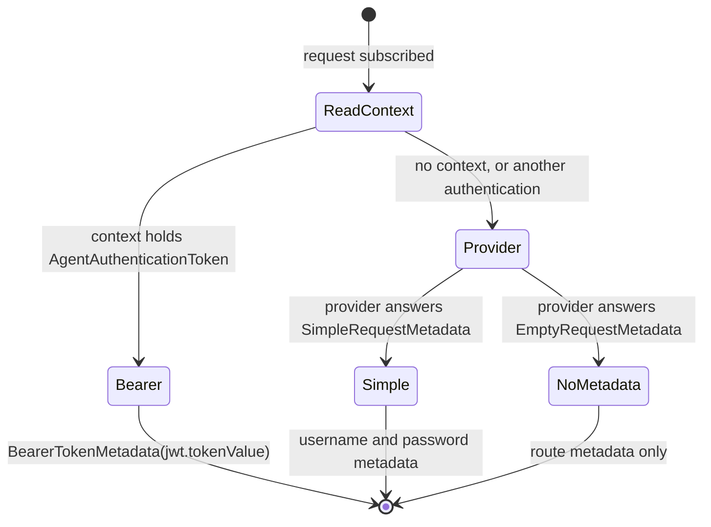
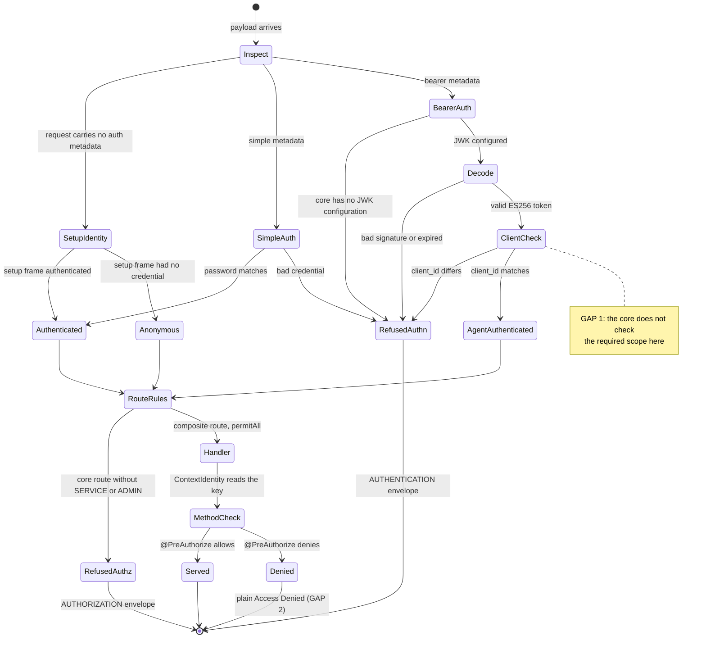
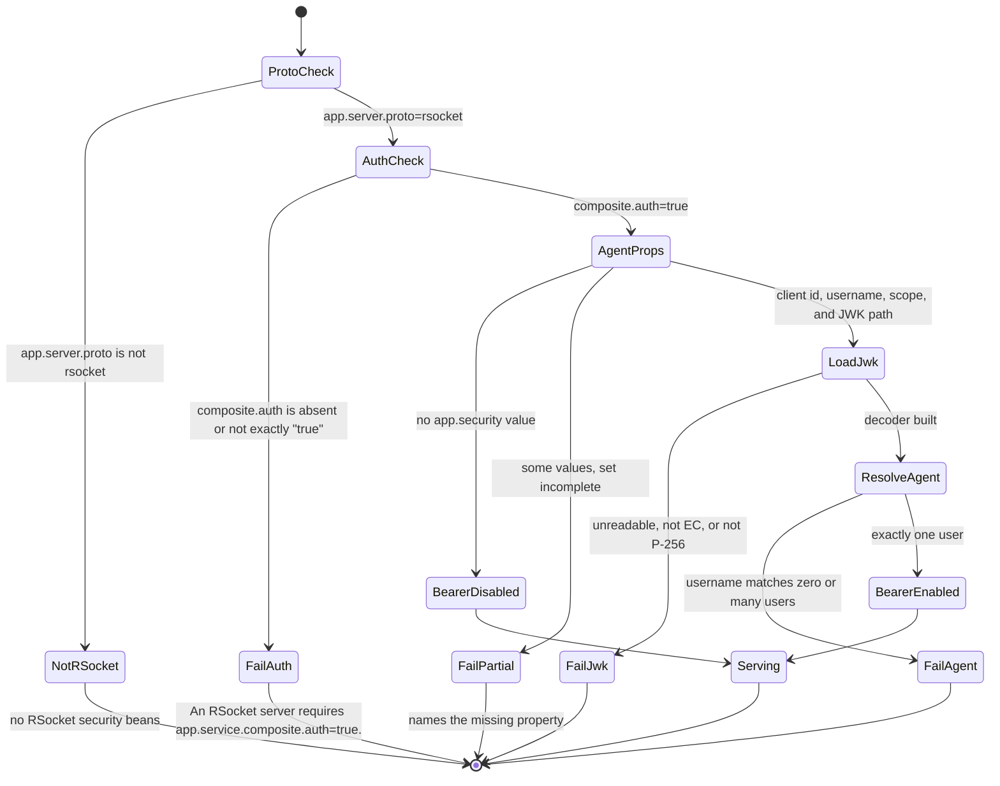

# REST token relay

These diagrams describe `CHAT-mpjtnpqv` as the code implements it at
`e036cf67`. They were read from source. They were not drawn from the spec.

The sources are the
[design specification](superpowers/specs/2026-10-03-rest-token-relay-design.md)
and the [implementation plan](superpowers/plans/2026-10-03-rest-token-relay.md).

Two gaps are marked **GAP** in the diagrams. Each one is read from source and
is not measured. See [Known gaps](#known-gaps).

## Components on the main path

An agent token enters at the REST facade. The facade relays the token to the
core on every delegated request.

The `chat-security` module holds the shared parts. These are
`AgentSecurityProperties`, `AgentJwtDecoderFactory`,
`AgentAuthenticationConverter`, `AgentAuthenticationToken`, and
`AgentIdentity`. Both processes use the same classes.

## The request, end to end

This sequence shows a room creation by the agent. The REST facade and the core
are separate processes.

The numbers in brackets are the interceptor orders. Spring Security sets
`AUTHENTICATION` to 200, `ANONYMOUS` to 300, and `AUTHORIZATION` to 400.
`RSocketSecurityErrorPayloadInterceptor` returns order 100. So it wraps all
three, and it sees every refusal that they raise.

`RestToCoreBearerDeploymentTests` measures this path. It reads the stored
owner row and compares its principal with the `Agent` key.

## The refusal path

A refusal inside the interceptor chain reaches REST as a typed error. The
decoder does not read message text.

`authorizePayload` raises an authorization refusal only for the core routes:
`persist.**`, `index.**`, `pubsub.**`, `secrets.**`, `key.key`, and
`key.rem`. Each requires `ROLE_SERVICE` or `ROLE_ADMIN`. The agent principal
holds `ROLE_AGENT`, so the core refuses these routes to the agent.

## REST client: which metadata a request carries

`DeferredRequestSpec` chooses the metadata when the request is subscribed, not
when the requester is built. One shared connection can serve many callers.

`Simple` covers the shell login and the authorization server `Service`
credential. Neither path changed. The REST facade holds no `Service`
credential, so a REST call without an agent token carries no metadata. The
REST chain refuses such a call with 401 before delegation.

## Core: identity of one request

Request metadata has precedence over setup metadata. An invalid request
credential never falls back to the setup identity or to `Anon`.

`RSocketIdentityPrecedenceTests` covers the four entry branches.
`CoreBearerWithoutJwkTests` covers the refusal with no JWK.
`CoreBearerDenialNoDownstreamEffectsTests` covers the expired and
wrong-client refusals. It checks that the controller, persistence, index,
secrets, and pubsub receive no call.

## Core: startup states

The core refuses to start in every state where it would serve without the
security chain or with a partial agent configuration.

`BearerDisabled` still refuses bearer metadata, through
`BearerAuthenticationNotConfiguredManager`. It does not ignore it.

`AgentIdentityLifecycle` resolves the agent at phase `Int.MAX_VALUE - 3072`.
The root keys load earlier, at phase `Int.MAX_VALUE - 4096`. Both run before
the servers start.

## Known gaps

Both gaps are read from source at `e036cf67`. Neither is measured.

### GAP 1: the core does not check the required scope

The REST chain requires `SCOPE_<required-scope>` through
`AgentResourceServerChain`. The core bearer path does not. It checks the
signature, the expiry, and `client_id` alone.

So a token from the agent client with no `chat.mcp` scope gets 403 at REST.
The same token sent directly to the core authenticates as the agent. The
2026-09-30 acceptance run measured that the authorization server issues such
a token.

The issue scope requires the scope check at the core boundary.
`CoreBearerDenialNoDownstreamEffectsTests` has no wrong-scope case.

### GAP 2: a method security denial is not typed

The typed envelope covers refusals inside the interceptor chain only. A
`@PreAuthorize` denial happens in the handler, after the chain completes. So
it reaches REST as a plain `ApplicationErrorException` with `Access Denied`.

`CoreSecurityErrorDecoder` passes it through unchanged. `KeyRefusalAdvice`
holds no handler for it. The REST status for this case is not measured.

This is the main 403 case on the REST path. An example is an agent that
deletes a room it does not own. `RestCoreAuthenticationErrorMappingTests`
reads the advice annotations only. It does not send a request through the
REST boundary.
