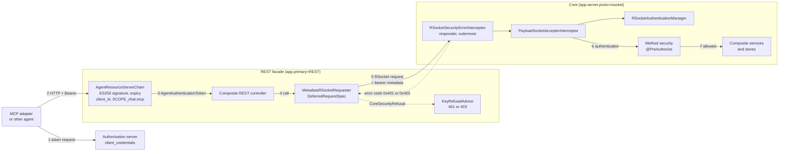
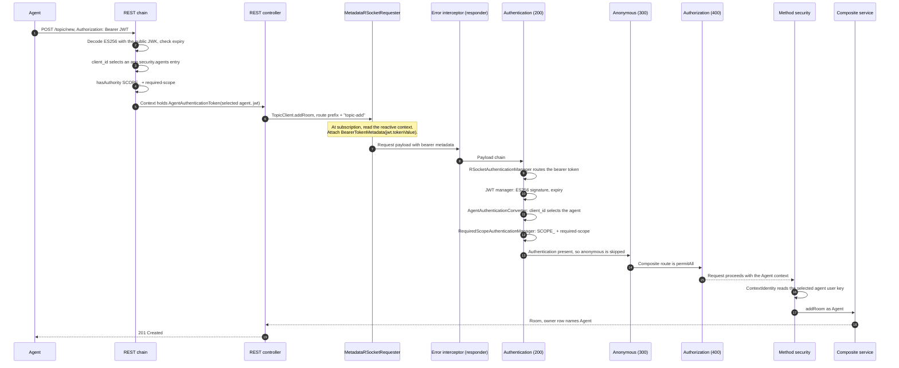
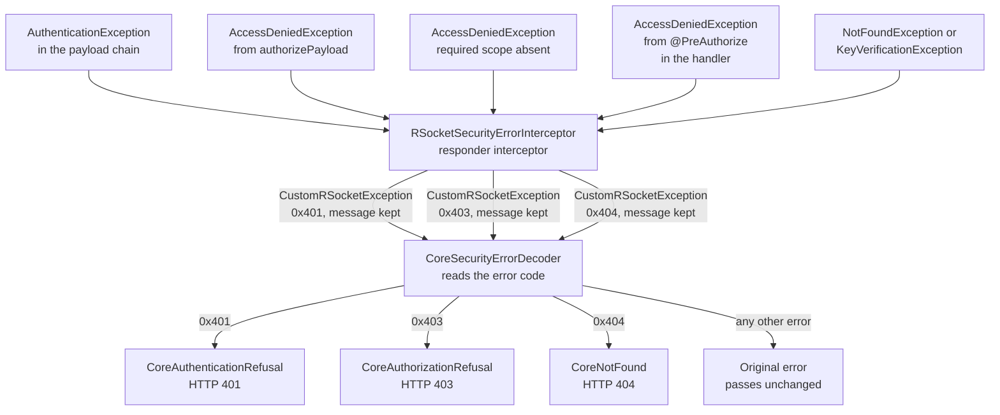
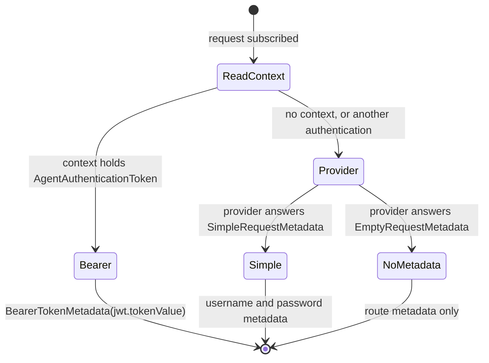
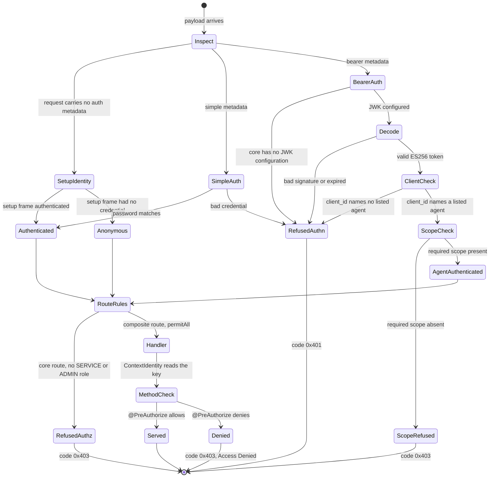
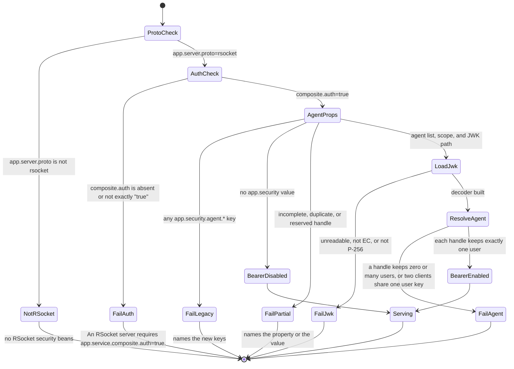

# REST token relay

These diagrams describe `CHAT-mpjtnpqv` as the code implements it. They were
read from source at `e036cf67`. They were updated for the core scope check
and for the RSocket error codes. They were not drawn from the spec.

The sources are the
[design specification](superpowers/specs/2026-10-03-rest-token-relay-design.md)
and the [implementation plan](superpowers/plans/2026-10-03-rest-token-relay.md).

The diagrams first showed two gaps. Both are closed now, and each closure is
measured. See [Closed gaps](#closed-gaps).

## Components on the main path

An agent token enters at the REST facade. The facade relays the token to the
core on every delegated request.

The `chat-security` module holds the shared parts. These are
`AgentSecurityProperties`, `AgentJwtDecoderFactory`,
`AgentAuthenticationConverter`, `AgentAuthenticationToken`,
`AgentIdentities`, and `AgentSecurityPropertiesGuard`. Both processes use the
same classes. Each process builds its own instances from its own agent list.

## The request, end to end

This sequence shows a room creation by the agent. The REST facade and the core
are separate processes.

The numbers in brackets are the payload interceptor orders. Spring Security
sets `AUTHENTICATION` to 200, `ANONYMOUS` to 300, and `AUTHORIZATION` to 400.

`RSocketSecurityErrorInterceptor` is not a payload interceptor. It is an
RSocket responder interceptor, so it wraps the outermost responder. It sees
every refusal of the payload chain. It also sees a `@PreAuthorize` denial,
which a reactive handler emits after the payload chain completes.

`RestToCoreBearerDeploymentTests` measures this path. It reads the stored
owner row and compares its principal with the `Agent` key.

## The refusal path

Every core security refusal reaches the client with an RSocket error code. The
message keeps its human text. The decoder reads the code and never the text.

Three sources raise an authorization refusal. The first is a bearer token
without the required scope. The second is `@PreAuthorize` in a composite
handler. The third is `authorizePayload`, for the core routes:
`persist.**`, `index.**`, `pubsub.**`, `secrets.**`, `key.key`, and
`key.rem`. Each requires `ROLE_SERVICE` or `ROLE_ADMIN`. The agent principal
holds `ROLE_AGENT`, so the core refuses these routes to the agent.

**A miss takes code `0x404`.** `CHAT-scoizkpm` added it on 2026-10-03. The
interceptor gives `NotFoundException` and `KeyVerificationException` that
code, and the decoder makes `CoreNotFound`. Before, a miss and a server
failure both left as `ApplicationErrorException` with code `0x201`, and only
the text told them apart. The shell room lookup reads `CoreNotFound` as a
miss, and it passes every other error to the caller.

**REST answers a core miss with 404, and the core message stays.**
`KeyRefusalAdvice.coreNotFound` holds the mapping. `CHAT-undefoqd` added it on
2026-10-03. Before, a core miss answered 500 with no message. Two tests
measured that status before the change: `RestCoreNotFoundMappingTests` and the
two-process `RestToCoreBearerDeploymentTests`. Both now pin 404. The REST
resolver also answers 404 for a local `KeyVerificationException`.

**An in-process miss answers 404 too.** A single process REST launch runs the
composite in the same JVM, so its miss is `NotFoundException` and not
`CoreNotFound`. `KeyRefusalAdvice.inProcessNotFound` maps it. `CHAT-sdvmkidi`
added it on 2026-10-04. Before, it answered 500.
`RestCoreNotFoundMappingTests` pins it.

## REST client: which metadata a request carries

`DeferredRequestSpec` chooses the metadata when the request is subscribed, not
when the requester is built. One shared connection can serve many callers.

`Simple` covers the shell login and the authorization server `Service`
credential. Neither path changed. The REST facade holds no `Service`
credential, so a REST call without an agent token carries no metadata. The
REST chain refuses such a call with 401 before delegation.

## Core: identity of one request

Request metadata has precedence over setup metadata. An invalid request
credential never falls back to the setup identity or to `Anon`.

`RSocketIdentityPrecedenceTests` covers the four entry branches.
`CoreBearerWithoutJwkTests` covers the refusal with no JWK.
`CoreBearerDenialNoDownstreamEffectsTests` covers the expired and
wrong-client refusals. It checks that the controller, persistence, index,
secrets, and pubsub receive no call. It also covers the wrong-scope refusal on
the composite `topic.topic-add` route, beside a control where a valid agent
token adds a room on that route.

## Core: startup states

The core refuses to start in every state where it would serve without the
security chain or with a partial agent configuration.

`BearerDisabled` still refuses bearer metadata, through
`BearerAuthenticationNotConfiguredManager`. It does not ignore it.

`AgentIdentityLifecycle` resolves every agent at phase `Int.MAX_VALUE - 3072`.
The root keys load earlier, at phase `Int.MAX_VALUE - 4096`. Both run before
the servers start.

## More than one agent (CHAT-frcrctdp)

`app.security.agents[n]` binds one OAuth client id to one chat user handle.
`app.security.required-scope` is one value for every agent. The old
`app.security.agent.*` keys fail the start, and `AgentSecurityPropertiesGuard`
names the new keys. `AgentSecurityProperties` also binds the old `agent` block
only to refuse it. So `requireComplete` gives the same message on every call
site, and the message does not depend on which bean starts first.

The token `client_id` selects the agent, on REST and on the core. A token from
an unlisted client answers 401 on REST and `0x401` on the core. On the relay
path, REST forwards the token, and the core selects the agent again from its
own list.

**The two lists must agree.** No check compares them. Assume REST lists a
client and the core does not. REST then accepts the token, the core refuses it
with `0x401`, and REST answers 401. `chat-build --agent` emits the same list for
both processes.

`AgentIdentityLifecycle` keeps only a user whose handle equals the configured
handle. The Lucene user index lowercases the handle, so a lookup for `admin`
answers the user `Admin`. For the same reason, the reserved check and the
duplicate check compare handles without case. `Admin`, `Anon` and each service
account are reserved.

`RestAgentSelectionTests` measures the REST selection over HTTP in one process.
`CoreAgentSelectionTests` measures the core selection over RSocket.
`RestToCoreBearerDeploymentTests` measures the relay with two agents.
`shell-scripts/agent-http-gate.sh` runs the first and the last of these in
their own builds.

## Closed gaps

The diagrams were first read from source at `e036cf67`. They showed two gaps.
A test measured each gap before its repair.

### GAP 1: the core did not check the required scope

At `e036cf67` the core bearer path checked the signature, the expiry, and
`client_id` alone. The REST chain required the scope, and the core did not.

A token from the agent client with the `openid` scope alone created a room on
`topic.topic-add`.

`RequiredScopeAuthenticationManager` now wraps the core JWT manager. A token
without the required scope gets code `0x403`. REST answers 403 for the same
token. Both paths read the authority from
`AgentSecurityProperties.Agent.requiredAuthority`.

### GAP 2: a method security denial reached REST as 500

The first implementation typed refusals with a JSON envelope, from a payload
interceptor. A `@PreAuthorize` denial happens after the payload chain, so it
bypassed the envelope. `RestToCoreBearerDeploymentTests` measured 500 when the
agent removed a room that `Anon` created.

`RSocketSecurityErrorInterceptor` now wraps the outermost responder. It gives
every security refusal an RSocket error code. The same test reads 403.

**The wire shape of a handler refusal changed.** It was
`ApplicationErrorException` with code `0x201`. It is `CustomRSocketException`
with code `0x403` now. The message is still `Access Denied`.
`CompositeAccessEnforcementTests` and `CoreRouteAccessTests` pin the code.

### GAP 3: a single process REST launch served the core controllers unchecked

The REST chain requires one authority, the agent scope. A REST launch that
also ran the composite in its own JVM could mount the core REST controllers:
`persistence`, `index`, `key`, `secrets` and `pubsub`. None carries an access
check. Measured on 2026-10-04: an agent token wrote a message with another
sender into a room where `POST /message/send` answered 403.

The RSocket side refuses those routes at the seam, with `ROLE_SERVICE` or
`ROLE_ADMIN`. An agent token holds neither, so that rule does not transfer.

`agentResourceServerChain` now calls `CoreRestControllers.requireAbsent`. A
REST launch with any of the five switches fails at startup, and the message
names each switch. The facade of `chat-build rest` mounts none of them, so it
is unchanged. See `CHAT-bnnkhgbd`.
