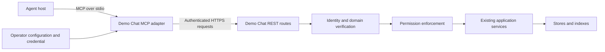

# Demo Chat MCP adapter

Date: 2026-09-27.
Tracking: CHAT-ylvoiixm.
Status: Draft for owner review and implementer assessment.

This document proposes a new interface. It does not report an implemented MCP server.
The owner requested a specification for another agent. Implementation is outside this task.

## 1. Objective and proposed scope

An MCP client can discover configured conversations, read messages, search within a topic, and send a message as its authenticated Demo Chat identity.

The owner confirmed read, search, and send on 2026-09-27.
Room creation, deletion, membership administration, and grant administration are excluded.
Global search, user search, credentials, raw indexes, and arbitrary persistence access are excluded.
Live subscriptions, historical timeline pagination, attachments, and encrypted payload processing are excluded.
Twilio integration is separate work.

Success means an external agent can use these tools through a real MCP client with enforced Demo Chat permissions.
A protocol demonstration against mocks does not establish permission enforcement.

## 2. Measured basis

The main checkout is master at `141dee77`. Its root identity document describes a design.
The implementation worktree contains reviewed commit `5238c3cb` and uncommitted T8 work.
This specification uses the reviewed implementation interfaces. It does not assume that branch is merged.
The implementer must recheck these interfaces after selecting the implementation base.

| Existing interface | Relevant behavior |
|---|---|
| `ChatTopicService` | Gets rooms by ID and lists rooms. |
| `ChatMessageService` | Gets one message, sends a message, and listens for live messages. |
| `MessageRecallService` | Searches messages within a topic, by user, or globally. |
| `MessageRecallResult` | Returns bounded hits and `indexComplete`. |
| `ChatMessageServiceRestMapping.restSend` | Derives the sender from `ChatUserDetails`, rather than a request body field. |
| `KeyVerifier` | Resolves IDs and verifies roots. Verification does not grant permission. |

The live topic endpoint is not a stored message history endpoint.
CHAT-znprrzhn remains open for production authorization enforcement.
Its recorded review requires an intercepted route or a separately proxied service.
An internal call to an annotated method does not establish enforcement.

## 3. Architecture decision

| Approach | Benefit | Cost |
|---|---|---|
| Standalone stdio adapter over REST, recommended | Reuses deployed APIs and supports local MCP clients. | Depends on secure backend routes and credential provisioning. |
| MCP embedded in the Spring application | Calls application services directly. | Adds protocol lifecycle and authentication concerns to the deployment. |
| Remote MCP gateway over Streamable HTTP | Supports shared remote clients. | Requires a separate MCP authorization and public transport design. |

The first version uses the standalone adapter. Remote MCP hosting requires a later specification.



The adapter has no database credentials and no direct store access.
The model cannot select backend URLs, credentials, sender IDs, or deployment partitions through tool arguments.

Proposed modules are `chat-mcp` and `chat-mcp-integration-test`.
Use Kotlin and the official Kotlin MCP SDK where compatible.
The distributable must compile with GraalVM Native Image under repository policy.
JVM execution may support development and tests. It does not replace the native acceptance test.

## 4. Protocol and transport

The target protocol revision is `2026-07-28`.
The implementer must verify support in the chosen SDK and target client before building the adapter.
Record exact dependency versions in the implementation plan.
If either side lacks support, report the mismatch before selecting another protocol revision.
Do not add a handwritten protocol compatibility layer.

Expose tools only in the first version. Do not expose MCP prompts, resources, sampling, or subscription extensions.
Use the selected revision for discovery, tool listing, calls, errors, and shutdown.
Protocol envelopes belong to the SDK. Application result objects below are separate from those envelopes.

Reserve stdout for MCP messages. Send diagnostics to stderr.
Exit when stdin closes, after bounded cancellation and cleanup.
Never automatically repeat a message send after process restart.

Sources: [MCP tools](https://modelcontextprotocol.io/specification/2026-07-28/server/tools),
[stdio](https://modelcontextprotocol.io/specification/2026-07-28/basic/transports/stdio),
and [official Kotlin SDK](https://github.com/modelcontextprotocol/kotlin-sdk).

## 5. Configuration and identity

One adapter process connects to one configured Demo Chat deployment using one credential.
The credential represents a specific user or a dedicated agent account with explicit grants.
Account creation and grant changes happen outside MCP.

Required configuration:

| Setting | Contract |
|---|---|
| `backendBaseUrl` | Fixed HTTPS origin. Explicit loopback development mode may use HTTP. |
| `credentialFile` | Operator-controlled file containing a backend access token. Never a command-line token. |
| `keyType` | Exactly `long` or `uuid`. |
| `topicIds` | Between one and 100 unique canonical IDs. This bounds the adapter scope. |
| `enableSend` | Defaults to false. Operator opt-in exposes the send tool. |
| `enableSearch` | Defaults to false. Operator opt-in exposes topic recall. |

The backend must authenticate the token and resolve its principal through the existing identity contract.
The adapter must not decode a token and treat its claims as verified identity.
Redirects to another origin are refused. Credentials never follow redirects.
Expired credentials produce an authentication error. The adapter has no interactive login or token-refresh tool.
Automatic credential refresh is outside this version.

The topic allowlist narrows scope. It is not a permission grant.
Read-only mode must enforce rejection even when a client calls an unlisted write tool directly.
The backend remains responsible for per-operation authorization.

This stdio design uses a configured backend credential. It does not claim remote MCP OAuth support.
A later remote transport must follow the [MCP authorization specification](https://modelcontextprotocol.io/specification/2026-07-28/basic/authorization).

## 6. Identity representation

All MCP ID and root fields use JSON strings, including Long values.
This prevents loss when a client represents JSON numbers as floating-point values.

Long input must be canonical base-10 integer text within the Long range.
Reject zero, fractions, exponent notation, whitespace, leading plus signs, leading zeros, and overflow.
UUID input must be canonical lowercase UUID text. Reject the zero UUID.
These are adapter input rules. They do not redefine every existing backend parser.

Tool inputs carry IDs, not client-selected roots. Each input position fixes the expected domain.
The backend resolves IDs through its registry and checks the expected domain.
The adapter encodes a Long as an exact integer when the existing REST body requires a number.
It must never convert IDs through Double or Float.

Returned keys use this shape:

```json
{"id":"1234567890123456789","root":"987654321012345678"}
```

Reject backend keys that are empty or lack an ID or root.
Do not synthesize roots, accept placeholders, or expose key minting as an MCP tool.
The adapter does not change the existing Demo Chat wire format.

## 7. Tool contracts

Each tool must declare input and output JSON Schemas.
Inputs are objects with `additionalProperties: false`.
Fields below are required unless a default is stated.
Names and descriptions must remain stable within this API version.

| Tool | Input | Successful application result |
|---|---|---|
| `chat_list_topics` | `{}` | `{topics: Topic[]}` containing only configured, permitted topics. |
| `chat_get_topic` | `{topicId: Id}` | `{topic: Topic}`. |
| `chat_get_message` | `{messageId: Id}` | `{message: Message}`. |
| `chat_search_messages` | `{topicId: Id, query: string, limit?: integer}` | `{indexComplete: boolean, hits: SearchHit[]}`. Limit defaults to 10 and ranges from 1 to 50. |
| `chat_send_message` | `{topicId: Id, text: string}` | `{messageKey: KeyRef, outcome: "accepted"}`. |

`Id` follows section 6. `KeyRef` is its returned key object.
`Topic` contains `key: KeyRef` and `name: string`.
`Message` contains `key: KeyRef`, `senderId: Id`, `topicId: Id`, `text: string`, and `timestamp: string`.
The timestamp is the stored message timestamp in ISO-8601 UTC form.
`SearchHit` contains `message: Message` and `score: number`.
The score must be finite. It is a relevance measure, not an identity or probability.

The adapter obtains each configured topic through its ID endpoint.
It omits unavailable or denied topics from `chat_list_topics` without reporting their names or count.
It fails the whole list on authentication, transport, or backend failures.
It does not call the unbounded topic-list endpoint.
At most 100 topics can appear, so the first version needs no topic pagination.

Every topic argument must be in the configured allowlist.
A message result must also belong to a configured topic before emission.
Backend authorization must occur before message content leaves the backend.
The local topic check cannot replace that backend check.

Search stays within one configured topic. Query text must contain one to 2,000 characters and must not be blank.
Use the backend default threshold of zero. Do not expose query syntax or raw index operations.
Read permission must cover each returned message.
Permission filtering may return fewer hits than requested. Do not fill the gap from another topic.
Keep the backend `indexComplete` flag unchanged.
An incomplete empty result does not prove that no matching message exists.

Send text must contain one to 16,384 UTF-8 bytes and must not be blank.
Do not silently trim, truncate, or rewrite it.
The backend derives the sender from authentication.
The adapter accepts no sender override and performs no automatic send retry.
`accepted` means the backend returned its success response and message key.
It does not prove recipient delivery, durable storage, or exactly-once execution.

Read tools declare `readOnlyHint=true` and `idempotentHint=true`.
Send declares `readOnlyHint=false`, `destructiveHint=false`, and `idempotentHint=false`.
These annotations describe behavior. They do not authorize an operation or replace host consent controls.

## 8. Backend route mapping

These routes were inspected in the root identity implementation worktree.

| Adapter operation | Existing route |
|---|---|
| Topic lookup | `GET /topic/id/{id}` |
| Message lookup | `GET /message/id/{id}` |
| Topic recall | `POST /message/recall/topic` |
| Send | `POST /message/send/{id}` with `text/plain` |

Topic recall uses the actual `TopicRecallRequest` serializer contract.
The implementer must test its discriminator and generic ID decoding against the running backend.
Do not infer the JSON envelope from the Kotlin field names alone.
Search hits must be resolved to authorized message records if the recall response lacks the complete message projection.
Do not emit indexed excerpts before those checks finish.

No tool calls `/persist`, `/index`, secrets routes, root publication endpoints, or arbitrary URLs.

## 9. Errors, limits, and cancellation

Invalid MCP envelopes and schema violations use protocol errors from the selected SDK.
Application failures use an MCP tool error result with a stable code and a short message.
Its application data has `code`, `message`, and `retryable` fields. Failed sends also include `outcome`.
`outcome` is `not_executed` or `unknown` for failed sends. It is absent for read failures.

| Code | Meaning |
|---|---|
| `AUTHENTICATION_REQUIRED` | Credentials are missing, invalid, or expired. |
| `NOT_AVAILABLE` | The requested object is absent, denied, or outside configured scope. |
| `FEATURE_UNAVAILABLE` | Recall or another required backend feature is unavailable. |
| `BACKEND_UNAVAILABLE` | A backend transport or service failure occurred. |
| `LIMIT_EXCEEDED` | A response or configured work limit was exceeded. |
| `OUTCOME_UNKNOWN` | A send may have executed, but no reliable result arrived. |

Do not expose raw backend exception messages or distinguish hidden objects from missing objects.
A timeout after dispatch must not claim that a send failed without effects.
Failed sends always have `retryable=false` because this version provides no durable deduplication contract.
The user must reconcile an unknown send before attempting another send.

Use a five-second connect timeout and a 30-second call deadline.
Allow at most four concurrent backend requests per adapter process.
Limit each backend response and each emitted tool result to one MiB of UTF-8 JSON.
Fail when a result exceeds its limit. Do not return a silently shortened result.
Propagate cancellation to outstanding reads.
Cancellation after send dispatch cannot promise rollback.

Log tool name, request correlation ID, duration, result code, and backend status to stderr.
Do not log tokens, message text, search text, or complete payloads by default.
Conversation text is untrusted content. It cannot change tool policy, credentials, or destination configuration.

## 10. Release prerequisites

The root identity implementation must reach the selected integration base.
CHAT-znprrzhn or equivalent reviewed work must establish enforcement on every route this adapter uses.
The grant policy must define who can read each topic and message, run recall, and send.
An MCP-specific allowlist does not complete that policy work.

Read authorization is required even for a read-only release.
Search must not leak denied snippets, scores, message IDs, or counts.
The real send route must reject impersonation and denied callers before storage, indexing, or publication.
These are release requirements. The specification does not claim they already pass.

SDK compatibility, native compilation, authenticated REST identity, and wire decoding require early feasibility tests.
If any prerequisite fails, the implementer must report it before claiming a usable integration.
Protocol scaffolding and tests against substitutes may proceed independently, with their evidence limits stated.

## 11. Acceptance tests

1. Connect a real MCP client to the native executable. Discover and call each enabled tool.
2. Confirm that stdout contains only valid protocol messages. Confirm clean shutdown when stdin closes.
3. Test Long IDs above `2^53` and canonical UUIDs through the complete adapter-to-backend path.
4. Reject fractional, numeric JSON, overflowing, malformed, and zero IDs before backend dispatch.
5. Test absent, expired, and wrong-audience credentials against the real backend authentication boundary.
6. Test two principals with different grants against the same topics and messages.
7. Prove that denied sends cause no store, index, or pub/sub effect.
8. Prove that a tool argument cannot choose a sender, token, backend origin, or root.
9. Prove that denied search hits expose no indexed content or identity.
10. Preserve `indexComplete=false` for an incomplete empty search.
11. Refuse disabled tools even when called directly by name.
12. Simulate a connection loss after send dispatch. Return an unknown outcome without a retry.
13. Test cancellation, response size limits, and concurrency bounds.
14. Test topic discovery with permitted, denied, missing, and unavailable backend responses.
15. Verify that topic names containing punctuation do not trigger a name-based lookup.
16. Run relevant repository gates after integration. Rebuild any image used for changed wire behavior.

The implementation review must distinguish protocol tests, backend contract tests, permission tests, and native executable tests.
A passing SDK sample does not satisfy this list.

## 12. Handoff boundaries

The next agent must review this draft with the owner before implementation.
The read, search, and send scope is approved.
The stdio transport and configured topic set remain proposals for product review.

After approval, create a bounded implementation plan with separate protocol, backend adapter, and acceptance-test tasks.
Keep the root identity worktree unchanged.
Do not merge this proposal into the root identity PR as an incidental documentation edit.
Do not implement deployment-wide tracing, token refresh, a second grant engine, or generic database tools within this task.

Source paths for reinspection:

- `chat-core/src/main/kotlin/com/demo/chat/service/composite/ChatMessageService.kt`
- `chat-core/src/main/kotlin/com/demo/chat/service/composite/ChatTopicService.kt`
- `chat-core/src/main/kotlin/com/demo/chat/service/vector/MessageRecallService.kt`
- `chat-core/src/main/kotlin/com/demo/chat/service/vector/MessageRecallResult.kt`
- `chat-core/src/main/kotlin/com/demo/chat/domain/RequestResponse.kt`
- `chat-webflux/src/main/kotlin/com/demo/chat/controller/webflux/composite/mapping/ChatMessageServiceRestMapping.kt`
- `chat-webflux/src/main/kotlin/com/demo/chat/controller/webflux/composite/mapping/ChatTopicServiceRestMapping.kt`
- `chat-webflux/src/main/kotlin/com/demo/chat/controller/webflux/ChatMessageRecallController.kt`
